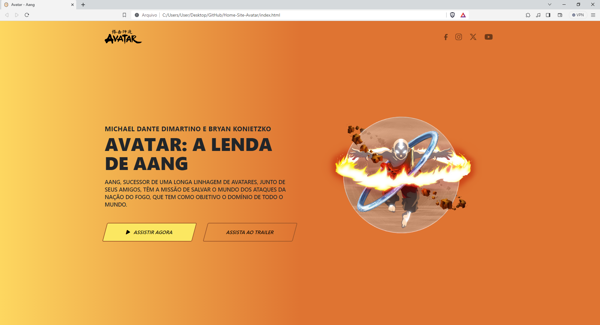
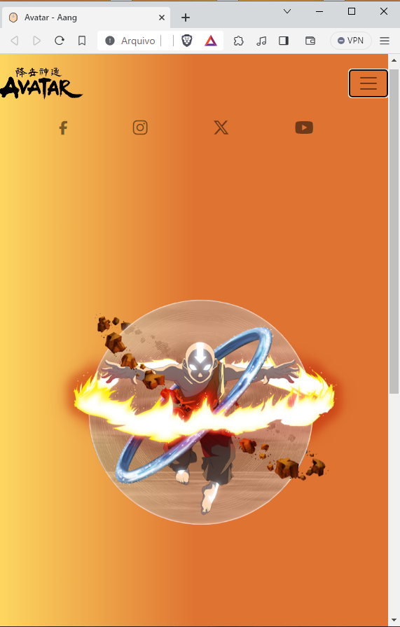
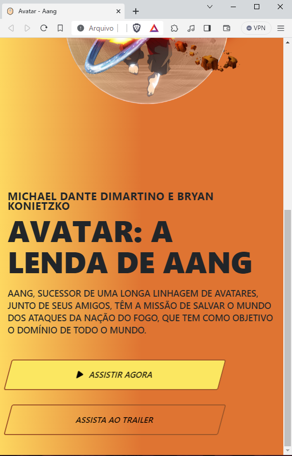

# Home-Site-Avatar
Realizei um dos desafios propostos pela Comunidade Codelândia, porém com a temática de Avatar: A lenda de Aang. Neste projeto eu utilizei o Bootstrap, aplicando conceitos de barra de navegação, divisões de tela, media queries, alinhamento, botões, breakpoints, animação na imagem, entre outros.

O site responde bem a todos os tamanhos de tela, abaixo deixarei as imagens de como fica em large devices e small devices, lembrando que a animação da imagem sempre permanece de forma funcional também.

Home Fullscreen:

Home Small Devices:

